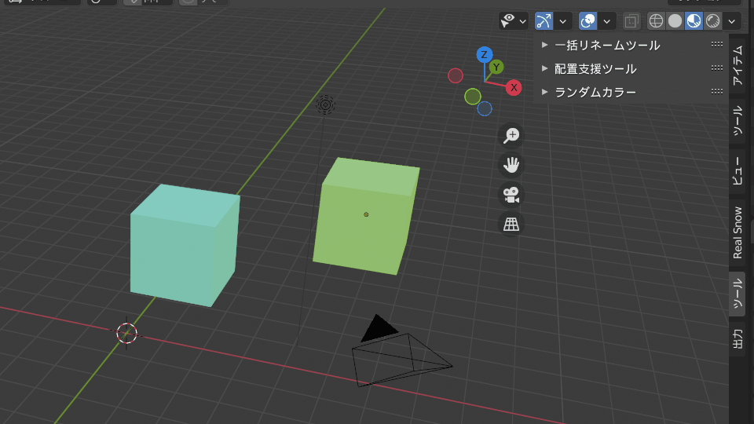
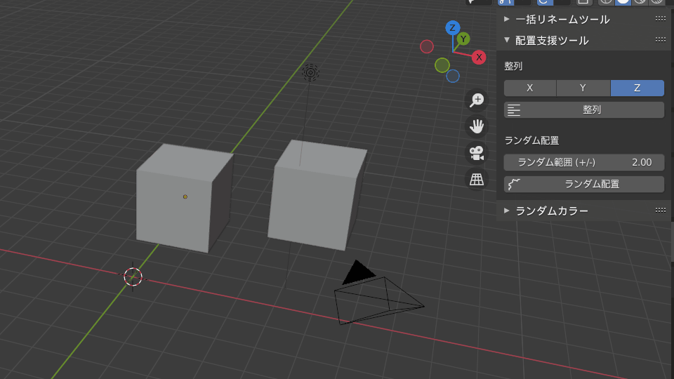
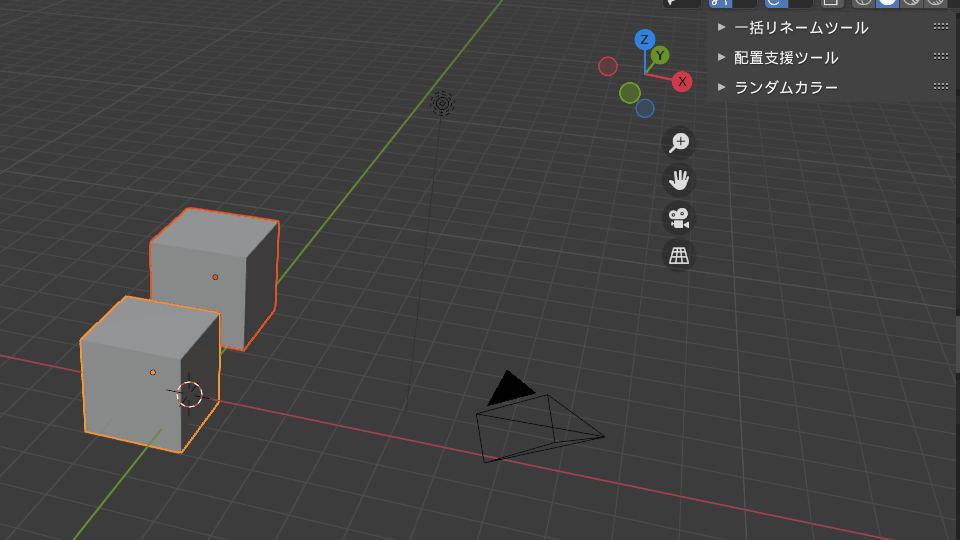
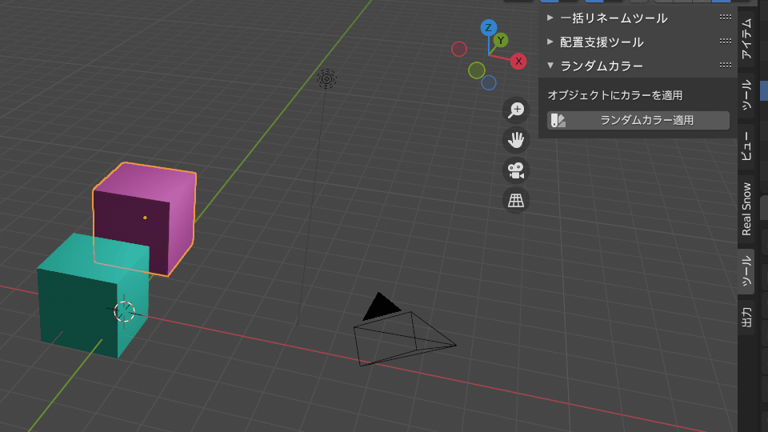

# Blender Addon Portfolio

このリポジトリは、Blender用のカスタムアドオンを集めたポートフォリオです。Pythonを用いて、モデリングや出力作業を効率化するツールを開発しています。

---

## 🔧 アドオン一覧と機能

### 1. 📝 一括リネーム（batch_renamer.py）
選択中のオブジェクト名に接頭辞・接尾辞を付けてリネーム。連番にも対応。

## 🎬 実演GIF

---

### 2. 📐 整列ツール（align_tools.py）
選択オブジェクトをX/Y/Z軸に沿って整列させます。

## 🎬 実演GIF

---

### 3. 🎨 ランダムカラー適用（random_colorizer.py）
オブジェクトにランダムな色をマテリアルで割り当てます。

## 🎬 実演GIF

---

### 4. 📤 FBX出力支援（fbx_export_helper.py）
選択中の各オブジェクトを個別のFBXとして出力します。

## 🎬 実演GIF

---

## 🔽 使用方法

1. Blenderの[アドオン]から `.py` ファイルをインストール
2. `Nキー` を押してサイドバー表示（必要に応じて）
3. 各アドオンに対応したUIやOperatorを操作

---

## 📜 ライセンス

MIT License

---

## 🧑‍💻 作者 Tatsuya Kagawa

このアドオンは、UnityやC#での開発経験を活かして作成された、Python初心者からの挑戦ポートフォリオです。
